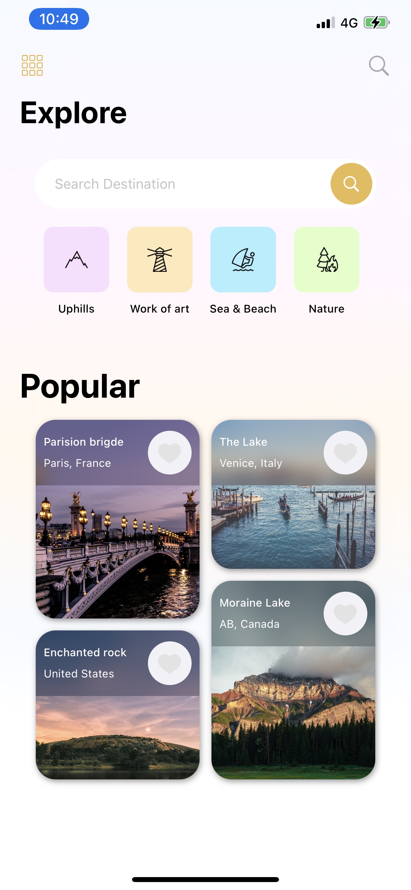
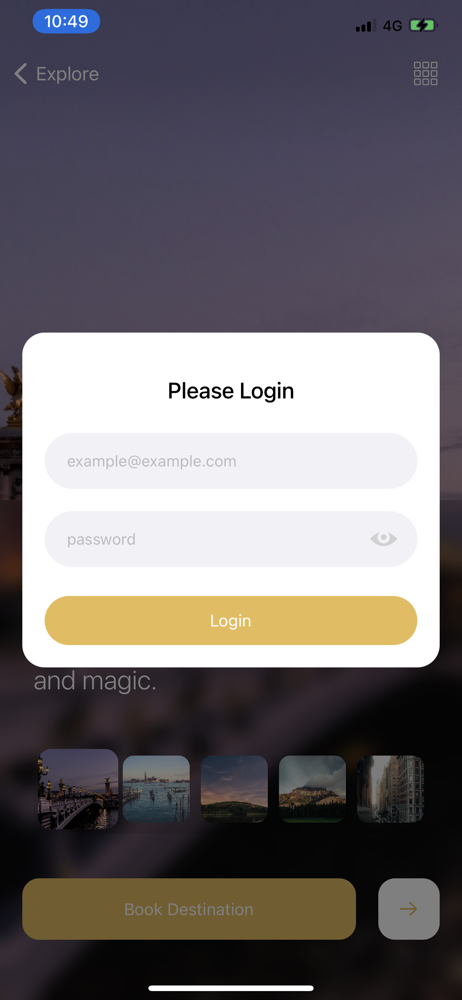

# AppsSquare iOS Task
> Task for job opportunity as iOS Developer

[![Swift Version ][swift-image]][swift-url]
[![Build Status][travis-image]][travis-url]
[](https://img.shields.io/cocoapods/v/LFAlertController.svg)  
[](http://cocoapods.org/pods/LFAlertController)
## Demo





## Requirements

- iOS 13.0+
- Xcode 10.3

## Installation

#### CocoaPods
You can use [CocoaPods](http://cocoapods.org/) to install `NeededLibraries`:

just run this terminal command  in the file root

```terminal
pod install
```

## Meta

Basem Ahmed Elgendy – [@Linkedin](https://www.linkedin.com/in/basemelgendy95/) – Basem_elgendy95@hotmail.com


[https://github.com/BasemElgendy95](https://github.com/BasemElgendy95)

[swift-image]:https://img.shields.io/badge/swift-5.0-orange.svg
[swift-url]: https://swift.org/
[license-image]: https://img.shields.io/badge/License-MIT-blue.svg
[license-url]: LICENSE
[travis-image]: https://img.shields.io/travis/dbader/node-datadog-metrics/master.svg?style=flat-square
[travis-url]: https://travis-ci.org/dbader/node-datadog-metrics


